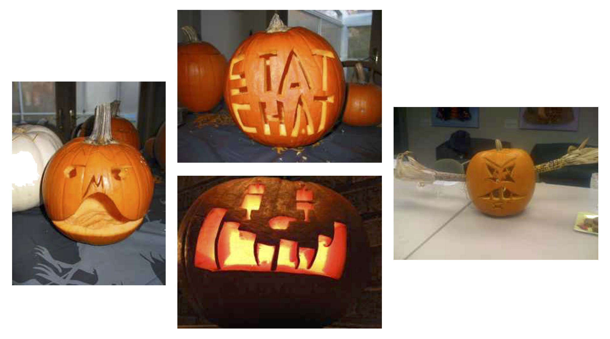

This is an archive of information/links from past StatChat meetings.		

  

## 2018--2019 Season (Year 12)

 

#### November 14, 2018

As we haven't met in quite some time, this meeting will be quite informal—meeting new friends, catching up, and ad hoc sharing of what is happening in your statistics/data science classroom. We will also use the time to plan the dates and agendas for future StatChats. If you can, please bring a snack or beverage to share.  

- **Location:** Olin-Rice Hall (Room 243) on the Macalester Campus [map]
- **Day:** Wednesday November 14, 2018
- **Time:** 6:00–8:00pm
- **Parking:** There is a free parking lot (off of Snelling Avenue) adjacent to Olin-Rice.

  

## 2011--2012 Season (Year 6)

 

#### October 28, 2011

- **Speaker:** Xiao-Li Meng (Harvard University)
- **Topic:** Statistical Education and Educating Statisticians: Producing Wine Connoisseurs and Master Winemakers

> Xiao-Li will talk about his innovative course in intro stats as well as his program to prepare excellent teachers of statistics. Following the talk, you are invited to stay on and visit with Xiao-Li as part of an informal social hour with our statistics education faculty and graduate students.

- [Stat 105](http://www.stat.harvard.edu/Academics/invitation_chair_txt.html) at Harvard

 

#### January 20, 2012

- **Speaker:** Charles Guyer (University of Minnesota, School of Statistics)
- **Topic:** What Statistics 101 Doesn't Teach, But Should

 

#### February 24, 2012

Sponsored jointly by StatChat and Project MOSAIC

- **Speaker:** Michael Bulmer (University of Queensland, Australia)
- **Topic:** The Island: Letting Students Experiment and Collect Data

Access the [Webinar Recording](http://www.mosaic-web.org/go/MCAST/videos/MCAST-2012-02-24/lib/playback.html) here.

 

#### March 8, 2012

- **Dessert Activity:** The Omnipresence of Coincidence (Milo Schield; Augsburg University)

> Coincidence is much more likely than expected, leading many people to conclude that there is something more going on than "mere" coincidence. Educators often see this differently, and ponder how to lead students to a more accurate idea of "expected." I'll describe some spreadsheets to make the unseen more visible and help students challenge and develop their notion of "expected". The spreadsheets demonstrate runs with coins, linear and non-linear clusters in a two-dimensional grid, and the Birthday problem.

- **Journal Club:** Arnold, P., Pfannkuch, M., Wild, C., Regan, M., Budgett, S. (2011) [Enhancing atudents' inferential reasoning: From hands-on to "movies"](http://jse.amstat.org/v19n2/pfannkuch.pdf). *Journal of Statistics Education, 19*(2).

- **Speaker:** Rob Gould (UCLA)
- **Topic:** Educating Citizen Statisticians

> What do we want out students to learn in an introductory statistics course? Historically, the answers have ranged from "How to compute ..." to "How to read the newspaper" to "How to analyze data" to "It depends on who the students are." Most of these discussions took place in a context in which data were hard to come by and statistical analysis tools were expensive. But today we live in a world where data are ubiquitous and anyone with an internet connection can analyze data. In this new data-driven world, I will argue that there is a core curriculum needed by all students, regardless of major and that the purpose of this core is to teach them to be Citizen Statisticians. We'll discuss how the new textbook I wrote with Colleen Ryan, Introductory Statistics: Exploring The World Through Data, was written to provide a core statistics education to all students regardless of background or mathematical preparation.

 

#### May 7, 2012

- **Speaker:** Allan Rossman (Cal-Poly)

 

#### May 9, 2012 

Joint meeting of StatChat and the Twin Cities chapter of the American Statistical Association. 

- **Guest Speaker:** Daniel Kaplan (Macalester College)
- **Topic:** Recent U.S. Supreme Court Finding on Statistical Significance

> “Supreme Court decisions famously reflect political divides, but they also are a
product of the multiple simultaneous objectives of the legal system: creating incentives for
honest behavior, distributing risk and cost among competing parties, and maintaining
predictability, among others. Statistical theory was created for a completely different set of
objectives, of which a major one is supporting an idealized scientific process of nonpartisan,
disinterested investigation. The Matrixx case inhabits a domain where both sets of
objectives apply: the desire for informed scientific judgment and the exigencies and
conflicts of civic life. Whenever multiple objectives are involved, it's likely that not all of the objectives will be fully realized. Or, to quote Dickens's Mr. Bumble, "The law is an
ass." The question is whether statistics is likely to be any less so when dealing with
complex matters of allocation and decision-making. I'll discuss in particular the extent to
which the canonical set of topics covered in university-level statistics education is oriented
toward supporting quantitatively sophisticated, effective decision making in the civic
domain.

  

## 2010--2011 Season (Year 4)

 

#### Sept. 28, 2010

- **Journal Club:** 
  + Wieman, C. (2009). [Why not try a scientific approach to science education?](https://www.science20.com/carl_wieman/why_not_try_scientific_approach_science_education) [Blog].
  + Wieman, C. (2009). [A scientific approach to science education---Research on learning](https://www.science20.com/carl_wieman/scientific_approach_science_education_research_learning). [Blog].
  Wieman, C. (2009). [A scientific approach to science education---Reducing cognitive load](https://www.science20.com/carl_wieman/scientific_approach_science_education_reducing_cognitive_load). [Blog].
  Wieman, C. (2009). [A scientific approach to science education---Beliefs, guided thinking, and technology](https://www.science20.com/carl_wieman/scientific_approach_science_education_beliefs_guided_thinking_and_technology). [Blog].
  Wieman, C. (2009). [A scientific approach to science education---Technology and institutional change](https://www.science20.com/carl_wieman/scientific_approach_science_education_technology_and_institutional_change). [Blog].

- **Speaker:** Chad Topaz (Macalester College)
- **Topic:** Teaching with Blogs

> Personal response system (PRS) clickers are small, handheld electronic devices that students use to respond to instructor-posed questions in class. Blogs are online diaries that students can use to chronicle their learning outside of the classroom. I will discuss some pedagogical and technological aspects of using blogs and clickers to support student learning in quantitatively-focused courses. I will also connect clicker and blog pedagogy to two learning science frameworks, namely the four "centrisms" of Bransford et al., and the revision of Bloom's taxonomy by Anderson and Krathwohl.

- Higdon, J., &amp; Topaz, C. (2009) [Blogs and wikis as instructional tools](https://www.macalester.edu/~kaplan/statchat/AY2010/September/ht2009.pdf). *College Teaching, 57*(2), 105--109. 

 

#### Oct. 26, 2010

- **Journal Club:** Kuiper, S., &amp; Collins, L. (2009) [Guided labs that introduce statistical techniques used in research from multiple disciplines](https://www.macalester.edu/~kaplan/statchat/AY2010/October/games.pdf). *The American Statistician, 63*(4), 343--347.
- **Stat-o-Lanterns:** Presentation of this year's Stat-o-Lanterns! Bring your own statistical squash, likelihood lantern, jacknife jack-o-lantern, or probability pumpkin!

<i>Image credit:</i> Photos of previous years' Stat-o-Lanterns thanks to Michael Huberty.

- **Speaker:** Chad Topaz (Macalester College)
- **Topic:** Teaching with Clickers

> Personal response system (PRS) clickers are small, handheld electronic devices that students use to respond to instructor-posed questions in class. I will discuss some pedagogical and technological aspects of using clickers to support student learning in quantitatively-focused courses.

 

#### Nov. 30, 2010

- **Speaker:** Bob delMas (University of Minnesota, Educational Psychology)
- **Topic:** Applets in R

> You can create small, interactive programs in R. I'll show two of these. Rates Beat Humans simulates a guessing game from a psychology study. Another, which I'll call With or Without Replacement? That is the Question, is designed to help students understand the distinction between sampling with and without replacement, as well as when they are used. I will also demonstrate two GUIs (graphical user interfaces): one for conducting randomization tests and the other for estimating bootstrap confidence intervals.

- **Speaker:** Josh Paulson (RStudio)
- **Topic:** R-Studio: Delivering R through a Web Browser

> R-Studio lets you interact with R through a standard web browser. It allows you to move easily from one computer to another without losing your place, and provides other user-friendly features. The beta version is being used at several colleges and universities across the country. I'll talk about the applications to teaching to making R more accessible.

- **Speaker:** Danny Kaplan (Macalester College)
- **Topic:** Teaching Calculus with R

> It's likely that you have two immediate reactions to the title. (1) R is for statistics, not calculus. If you're going to use software at all for calculus --- and it's not clear that you should --- you should use a symbolic algebra package like Mathematica or Maple. (2) I don't teach (or study or use) calculus, so why should I care? In fact, it is more or less a historical accident that calculus is taught through algebra. In the late 1600s through 1900, that was the only technology that was available. The basic techniques of calculus --- differentiation and integration --- have no intrinsic relationship to the algebraic techniques. It's perfectly reasonable to present them entirely as simple software operations. And why you should care? Many of your mathematical ideas were formed by the calculus-oriented high-school curriculum that you went through. In those high-school years, you were drilled with algebraic and symbolic techniques. So you're good with algebra, even though you may rarely use it. Seeing how to represent and perform those operations with software can help you to develop general computational concepts and skills.

- **Discussion:** Why have an R Users' Group? What can it do for me?

 

#### Jan. 25, 2011

- **Journal Club:** Seife, C. (2010). *Proofiness: The dark art of mathematical deception.* New York: Viking.

- **Speaker:** Katie St Clair (St. Olaf) 
- **Topic:** Team-Based Learning

> Team-based learning (TBL) is a pedagogical strategy that involves groups of students working together in teams to learn and apply the course concepts. I will give an overview of TBL principles and talk about how we've used TBL in our stat literacy class at Carleton.

 

#### Feb. 22, 2011

- **Journal Club:** Cobb, G. (2007). [The introductory statistics course: A Ptolemaic curriculum?](https://escholarship.org/uc/item/6hb3k0nz) *Technology Innovations in Statistics Education, 1*(1).

- **Speaker:** Joan Garfield, Robert delMas, Laura Le, Rebekah Isaak, Laura Ziegler, and Andy Zieffler (University of Minnesota, Educational Pyschology)
- **Topic:** The CATALST Course

> CATALST is an NSF-funded project that has created a curriculum designed to develop students' statistical thinking and appreciation of statistics through a focus on modeling, simulation and inference. The CATALST curriculum is currently being taught in several sections of undergraduate-level statistics at the University of Minnesota and at NC State. We will share an overview of the curriculum, as well as a sample of class activities used in the course. Specifically, an activity used to introduce the randomization test for group inferences will be shared. The software TinkerPlots, which is used by students in the course to conduct the modeling and simulation, will also be demonstrated.

 

#### Mar. 29, 2011

- **Journal Club:** Bellos, A. (2010). [Situation normal](https://www.macalester.edu/~kaplan/statchat/AY2010/March/Ch10-Bellos-Euclid.pdf). In, *Here's looking at Euclid: From counting ants to games of chance - An awe-inspiring journey through the world of numbers* (pp. 246--265). New York: Free Press.

- **Speaker:** Robin Lock (St. Lawrence University)
- **Topic:** Starting Inference with Bootstraps and Randomizations

> Computer-intensive methods such as bootstrapping and randomization tests provide a way to introduce students to fundamental ideas of statistical inference that require relatively few prerequisites. I'll discuss an ongoing project to revamp an introductory course to use such methods as the starting point for inference.

 

#### April. 26, 2011

- **Journal Club:** The Math-Stats Course. Some questions: What should be the goal of the math stats course? What topics are essential?
  + TOC from Larsen and Marx, [An Introduction to Mathematical Statistics](https://www.macalester.edu/~kaplan/statchat/AY2010/April/TOC_LarsenMarx.pdf)
  + TOC from Chihara and Hesterberg, [Mathematical Statistics with Resampling and R](https://www.macalester.edu/~kaplan/statchat/AY2010/April/TOC_Wiley2011.02.07.pdf)

- **Speaker:** Milo Schield (Augsburg University) 
- **Topic:** Models and Assumptions: Statistics and Assembly

> Checking assumptions is a critical activity in modeling. Often times the assumptions used in analyzing data influence -- if not determine -- the results. I'll discuss an ISI draft paper that argues that statistics have the same status as models -- they involve choices in assembly that influence -- if not determine -- the results. One of the five elements of the AACU 2009 Quantitative Literacy Rubric was assumptions: "Ability to make and evaluate important assumptions in estimation, modeling, and data analysis." The ISI paper extends this focus on assumptions to include the formation of categories, measures and summary statistics. While statistics may have little to say about which assumptions are best, statistical literacy can highlight how choices in how groups are defined or how quantities are measured can influence the results.

- **Speaker:** Marc Isaacson (Augsburg University)
- **Topic:** USCOTS Theater-Teaching Activity: Multiple choice Olympic Success

> This activity incorporates audience involvement to evaluate data from Olympic Competition results through the use of rankings. While rankings are commonly encountered by students in their everyday life, they are rarely discussed in an introductory statistics class. Audience members will be presented a handout, a single question and then asked to respond via text message or smartphone. Results will be collected via the internet and discussed instantaneously with an interesting twist.

- **Speaker:** Milo Schield (Augsburg University)
- **Topic:** USCOTS Theater-Teaching Activity: Where do Statistics come from?

> This activity incorporates audience involvement to compare related rates or percentages. Central question: Where do statistics come from; how are they assembled; what difference do their definitions make in their size or in the size of their association?

  

## 2009--2010 Season (Year 5)

 

#### September 29, 2009

- **Data Dessert:** Internet flavor (Julie Legler)
- **Journal Club:** Moore, D. (1995) [The craft of teaching](http://www.stat.purdue.edu/~dsmoore/articles/Craft.pdf). *MAA Focus, 15*(2), 5--8.

- **Speaker:** Andy Zieffler (University of Minnesota, Educational Psychology)
- **Talk:** A Brief Illustrated History of Statistics Education

 

#### October 27, 2009

- **Journal Club:** Gould, R. (2004). [Variability: One statistician's view](https://escholarship.org/uc/item/4fm9w47f). *Statistics Education Research Journal, 3*(2), 7--16.

- **Speaker:** George Cobb (Mount Holyoke)
- **Talk:** Drug Deals and Jury Wheels: Probability and Statistics Go to Court

> In the case of US v. Shine et al., federal prosecutors in Burlington, Vermont wanted to send to jail a dozen accused drug dealers, all of them members of racial minorities. The defense team claimed that the citizens chosen to serve on the grand juries that had indicted the dozen accused dealers had been chosen using a jury selection method that was racially biased. If true, the legal rights of the accused under the US Constitution would have been violated, which would mean that they should be set free. The case involved a variety of issues, all statistical or mathematical, and so I was asked by the prosecutors to testify about these issues. In my talk I'll describe one particularly simple mathematical problem that figured prominently in the case, and illustrate two different ways to think about it. For me, these two ways exemplify two very general strategies for solving mathematical problems.

 

#### November 24, 2009

- **Short Report:** Project SENCER (Cindy Kaus; Metro State) 
- **Journal Club:** Brown, E., &amp; Kass, R. (2009). [What is statistics?](). *The American Statistician 63*(2), 105--110.

- **Speaker:** Victor Addona (Macalester College)
- **Talk:** A Course on Statistical Analysis of Sports and Games

Victor will describe the course he is teaching this semester to first-year students. Here is the course description: 

> In this course, we learn about the core descriptive, probabilistic, and inferential methods used in statistics. These topics will be motivated by using real data from a variety of sports. Quantitative analysis of sports data has become a serious research field. Baseball was the first North American sport to be studied by statisticians. The term coined by Bill James for this field, "sabermetrics", is widely recognized in the statistical community, and many professional sports teams now employ academic statisticians to help them gain an advantage over the competition. The acceptance of sabermetrics (aided by the popularity of books like Moneyball) has led to quantitative research in other sports, as objective decision making continues to replace the haphazard "gut feelings" used in the past. The plethora of examples that are sports related are not restricted to "traditional" sports data. For example, we will discuss data on the graduation rates, and birthdays(!), of athletes. As we will see, at the core of this course is a desire to answer questions of interest in impartial and meaningful ways. Ultimately, this is a statistics course, so we learn about different methods used to analyze data. But we will not lose sight of the fact that, in statistics, the final analysis is only one aspect of the process used to answer questions. For example, measurement issues are a crucial, but often overlooked, piece of the puzzle: What metric(s) should we use to decide which of two players is better? How do we assess strategies in a game?

 

#### January 26, 2010

- **Resources on the Web:** [Statistics Online Computational Resource](http://www.socr.ucla.edu/SOCR.html) (Bob delMas; University of Minnesota, Educational Psychology) 
- **Journal Club:** Cobb, G. W., &amp; Moore, D. S. (1997). [Mathematics, statistics, and teaching](https://www.macalester.edu/~kaplan/statchat/2009-2010-year/2010-01/January-2010.pdf). *American Mathematical Monthly, 104*(9), 801--823. 

- **Speaker:** Danny Kaplan (Macalester College)
- **Talk:** Hypothesis Testing: What's the Alternative?

> I know, you're thinking this is going to be a session about Bayesian inference. But it's just good ol' hypothesis testing. In looking through standard statistics texts and comparing what they say to what I do in my introductory classes, I've been struck by the very limited role that the alternative hypothesis plays. The alternative seems to be entirely about whether to do a one-sided or two-sided test, and is written in very abstract terms, e.g., Ha : p > 0.5. In my classes, I have the students work with very specific alternative hypotheses, e.g., p = 0.70. This has several advantages. It makes it clearer to the student that both the null and the alternative are 'hypotheticals', statements about world that might or might not be true. It also relates statistical practice more closely to scientific practice, where a person designing a study has to think about how big is the effect he or she is looking for. This leads directly to calculations of sample size and power. I'll show some settings in which I have students do these calculations. 

 

#### February 23, 2010

- **Journal Club:** Lovett, M., &amp; Greenhouse, J. (2000). [Applying cognitive theory to statistics instruction](https://www.macalester.edu/~kaplan/statchat/2009-2010-year/2010-02/LovettGreenhouse.pdf). *The American Statistician, 54*(3), 1--11.

- **Speaker:** Sandra J. Moen (3M)
- **Talk:** Teaching Experimental Design with a Paper Helicopter

> To paraphrase George Box, "All toys are fun; some toys are useful." 
The speaker "played" with helicopters in her graduate-school days when she worked for Prof. Box as a graduate assistant one year, and since then she has used them in statistics classes at 3M with good success with both technically-minded and not-so-technically-minded students. Drawing on Box's article from 1991, Teaching Engineers Experimental Design with a Paper Helicopter, there will be a brief introduction to the problem, presentation of a few ideas of how to incorporate it as an exercise in class to illustrate different types of statistical tools and questions, and then it's flight time! Try it out for yourself.

 

#### March 23, 2010

- **Journal Club:** Sotos, A. E. C., Vanhoof, S., Van Den Noortgate, W., &amp; Onghene, P. (2009). [The transitivity misconception of Pearson's correlation coefficient](https://www.stat.auckland.ac.nz/~iase/serj/SERJ8(2)_Sotos.pdf). *Statistics Education Research Journal, 8*(2), 33--55.

- **Speaker:** Paul Alper (University of St. Thomas)
- **Talk:** Hypothesis Testing: What's the (Other) Alternative

> Drawing on a concrete example from the paper by Michael Lavine, What is Bayesian Statistics and Why Everything Else is Wrong, Paul will review the areas of conflict and alignment between the Bayesian and hypothesis-testing paradigms. 

 

#### April 27, 2010

- **Journal Club:**
  + Pfaff, T., &amp; Weinberg, A. (2009). [Do hands-on activities increase student understanding?: A case study](http://jse.amstat.org/v17n3/pfaff.pdf). *Journal of Statistics Education, 17*(3).
  + Weltman, D., &amp; Whiteside, M. (2010). [Comparing the effectiveness of traditional and active learning methods in business statistics: Convergence to the mean](http://jse.amstat.org/v18n1/weltman.pdf). *Journal of Statistics Education, 18*(1).
- **Internet Resources:** Life on an Island - A Simulated Population for Learning Statistical Reasoning (Michael Bulmer; University of Queensland, Australia)

- **Speaker:** Michelle Everson (University of Minnesota, Educational Psychology)
- **Talk:** Creating Web Applets from In-Class Activities to Foster Active Learning in the Online Statistics Classroom

> In a classroom setting, students can engage in hands-on activities in order to better understand certain concepts and ideas. Replicating hands-on activities in an online environment, however, can be a challenge for instructors. Recently, at the University of Minnesota, we created two web applets to incorporate into our undergraduate online introductory statistics courses, and these applets are meant to provide opportunities for students to engage in the kinds of activities commonly used in comparable classroom sections. One applet goes along with an activity where students use Post-it Notes in an effort to develop a more conceptual understanding of the mean and the median, and the other applet is meant to replicate aspects of the famous "Gummy Bears in Space" activity (presented in Schaeffer, Gnanadesikan, Watkins & Witmer, 1996). This talk will focus on the development of these applets and the ways in which the applets are currently used in our online courses.

